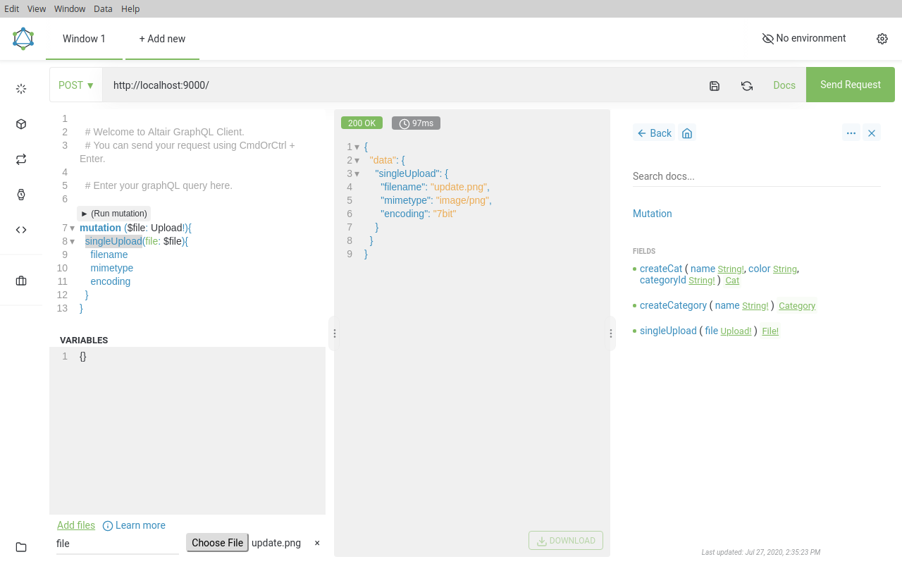

# file-upload-with-graphql

File Upload with GraphQL from a React Application

## preparation

- [Altair](https://altair.sirmuel.design/)

## installation

```shell script
cd client
yarn
cd ../server
yarn
```

## usage

```shell script
# start postgresql
docker run -it -p 5432:5432 -e POSTGRES_USER=postgres -e POSTGRES_PASSWORD=postgres -e POSTGRES_DB=postgres postgres
# start server
cd server && yarn start:dev
# start client
cd client && yarn start
```

### use Altair for uploading file



## documents

- [Apollo Server File Upload Best Practices](https://www.apollographql.com/blog/apollo-server-file-upload-best-practices-1e7f24cdc050/)
- [apollo-upload-client](https://github.com/jaydenseric/apollo-upload-client)

## license

MIT - [103cuong](https://github.com/103cuong/)

<!-- INSPIRATIONAL_QUOTE_START -->

🧑‍💻
<!-- INSPIRATIONAL_QUOTE_END -->
